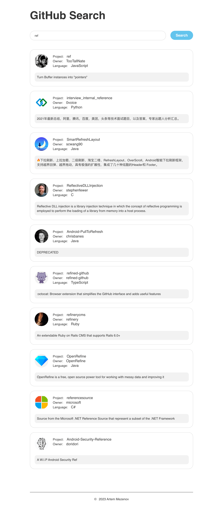

# Project "github-search"

## To run the project use - "make run".

### Screen demonstration:

### Functional:

- Search GitHub repositories by substring
- Validation of all forms

### Features:

- Responsive layout
- All text is overflow protected
- All fonts are included in the project

### Supported Browsers:

- edge from "17"
- ie from "11"
- firefox from "50"
- chrome from "64"
- safari from "11.1"

### Technologies:

- OOP
- BEM methodology
- BEM Nested file structure
- HTML
- SASS
- JavaScript
- REST API
- webpack
- Flexbox
- Grid Layout
- Git

### Language:

- English
